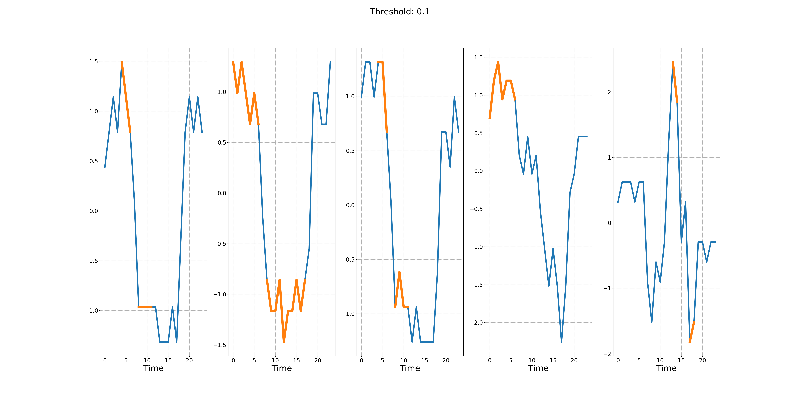

# SCAFE
## Simultaneous Clustering And Feature Extraction
This repository contains the code we used to test the model pipeline that we proposed in our CISBAT paper (September 2019).

### Model Overview

Figure above shows the overview of the pipeline that we use in our paper. We first encode the
time-series into three-channel images where the channels are Markov Transition, Gramian 
Angular Summation and Gramian Angular Difference Fields. Next, we train an undercomplete
autoencoder to learn the manifold of the underlying data-generating distribution. Finally,
we use ward-linking agglomerative clustering method to cluster the instances in the
latent space, based on the learned manifold.

### Centroids
We obtained centroids similar to those shown bellow:

### Features
We used a modified version of the Grad-CAM algorithm to visualize the 
features that contributed the most to the clustering:

## Running the code
Create the Anaconda environment by running:

`conda env create -f reqs.yml`

Activate the `scafe` environment by executing:
 
`conda activate scafe`.
 
Finally, install `pyts` by executing

`pip install pyts==0.7.5`

Note that the data should be stored in a `.csv` file. To run the autoencoder
training and clustering with feature extraction (full pipeline) run:

`python scafe.py --full --path ./path-to-your-data-csv/`.

We strongly recommend to train the model only on machines that have CUDA 
support.
